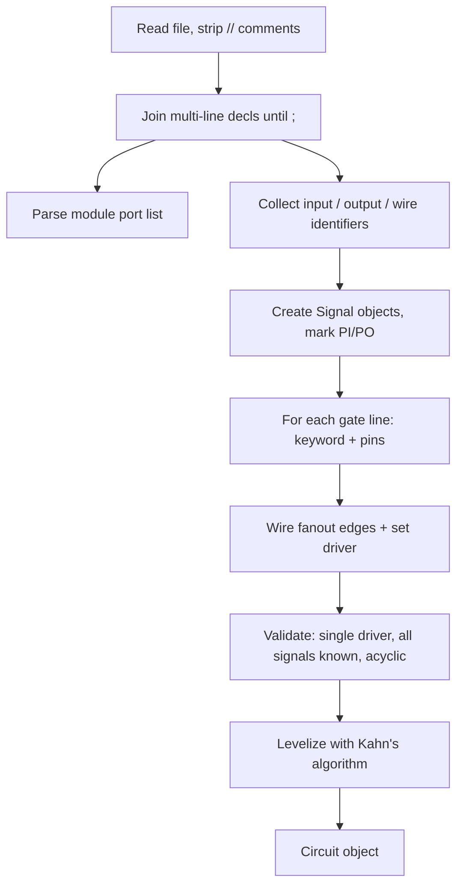

# ISCAS Verilog Parser — Design Reference

> Documentation derived from analysis of all 11 benchmark files in `ISCAS85_Circuits/`.
> Use this when implementing `src/parser/iscas_verilog.py` and the signal-centric `Circuit` model.

---

## Overview

The parser reads **ISCAS-style gate-level structural Verilog** (`.v`) and produces a **signal-centric `Circuit` object** used by fault collapsing, five-valued simulation, and PODEM. Downstream modules must not depend on Verilog syntax — only on `Circuit`, `Signal`, and `Gate`.

**v1 scope:** Primitive gate instances only (`and`, `or`, `nand`, `nor`, `not`, `buf`, `xor`, `xnor`). Reject `assign`, behavioral code, multi-driver nets, and sequential elements.

---

## Benchmark corpus

| File | PIs | POs | Wires | Gates | Logic depth | Max fanin | Max fanout |
|------|-----|-----|-------|-------|-------------|-----------|------------|
| c17.v | 5 | 2 | 4 | 6 | 3 | 2 | 2 |
| c432.v | 36 | 7 | 153 | 160 | 17 | **9** | 9 |
| c499.v | 41 | 32 | 170 | 202 | 11 | 5 | 12 |
| c880.v | 60 | 26 | 357 | 383 | 24 | 4 | 8 |
| c1355.v | 41 | 32 | 514 | 546 | 24 | 5 | 12 |
| c1908.v | 33 | 25 | 855 | 880 | 40 | 8 | **16** |
| c2670.v | 233 | 140 | 1,129 | 1,269 | 32 | 5 | 11 |
| c3540.v | 50 | 22 | 1,647 | 1,669 | 47 | 8 | **16** |
| c5315.v | 178 | 123 | 2,184 | 2,307 | 49 | 9 | 15 |
| c6288.v | 32 | 32 | 2,384 | 2,416 | **124** | 2 | **16** |
| c7552 (1).v | 207 | 108 | 3,405 | **3,513** | 43 | 5 | 15 |

**Suite totals:** 13,351 gates across 11 circuits.

### Global extremes

| Metric | Worst case | Value |
|--------|------------|-------|
| Gate count | `c7552 (1).v` | 3,513 |
| Primary inputs | `c2670.v` | 233 |
| Primary outputs | `c2670.v` | 140 |
| Internal wires | `c7552 (1).v` | 3,405 |
| Total signals | `c7552 (1).v` | ~3,720 |
| Logic depth (PI→PO) | `c6288.v` | 124 levels |
| Max fanin | `c432.v` | 9 (`AND9`) |
| Max fanout | `c1908.v`, `c3540.v`, `c6288.v` | 16 loads on one signal |

---

## File format

Every circuit follows the same structural pattern:

```verilog
// Verilog          ← optional metadata (missing in c1355.v)
// c880
// Ninputs 60
// Noutputs 26
// NtotalGates 383
// NAND2 60 ...     ← per-gate-type inventory (optional)

module c880 (...);     ← port list, often 10–40 lines
input ...;             ← multi-line, ends with ;
output ...;
wire ...;              ← hundreds to thousands of wires in large circuits
nand NAND2_1 (out, in1, in2);   ← one gate per line
...
endmodule
```

### What is **not** in this corpus

- No `assign` statements
- No `reg`, `always`, or behavioral code
- No `xnor` gate instances (support in parser for future-proofing only)
- No multi-driver nets
- No undriven nets (once declarations are parsed correctly)

---

## Gate representation

### Pin order (always the same)

```verilog
<keyword> <instance_name> (output, input1, input2, ...);
```

- **Output is always the first** argument.
- **Inputs follow**, comma-separated.
- **Fanin** = `len(pins) - 1`.

| Pattern | Example | Fanin |
|---------|---------|-------|
| Inverter | `not NOT1_1 (N190, N1);` | 1 |
| Buffer | `buf BUFF1_21 (N257, N69);` | 1 |
| 2-input | `nand NAND2_1 (N10, N1, N3);` | 2 |
| 5-input | `and AND5_0(N996,N925,N950,N912,N951,N986);` | 5 |
| 9-input | `and AND9_46 (N199, N154, ..., N180);` | 9 |

### Gate keyword → internal `GateType`

Use the **Verilog keyword**, not the instance name prefix:

| Keyword | Total count | Circuits present |
|---------|-------------|------------------|
| `nand` | 2,999 | 9 / 11 |
| `and` | 2,877 | 10 / 11 |
| `not` | 2,760 | 10 / 11 |
| `nor` | 2,370 | 8 / 11 |
| `buf` | 1,563 | 7 / 11 |
| `or` | 660 | 7 / 11 |
| `xor` | 122 | **c432, c499 only** |
| `xnor` | 0 | none in dataset |

Instance names (`NAND2_17`, `AND5_0`, `NOR8_3`, `NAND8_696`) encode fanin as a hint, but **pin count is authoritative**. Example: `nand NAND8_696 (N2279, N2067, ..., N903);` has 8 inputs regardless of naming.

Map keywords to enum (lowercase Verilog → uppercase enum):

```
and → AND, or → OR, nand → NAND, nor → NOR,
not → NOT, buf → BUF, xor → XOR, xnor → XNOR
```

### Fanin distribution (13,351 gates)

| Fanin | Gate count | Share |
|-------|------------|-------|
| 1 | 4,323 | ~32% |
| 2 | 7,657 | ~57% |
| 3 | 911 | ~7% |
| 4 | 290 | |
| 5 | 142 | |
| 8 | 23 | |
| 9 | 5 | |

Multi-input gates (fanin ≥ 3) are uncommon but must be supported. Observed shapes include `AND3`–`AND9`, `OR3`–`OR5`, `NAND3`–`NAND9`, `NOR3`–`NOR8`.

### Fanout distribution

Example for `c7552 (1).v` (largest circuit):

| Fanout | Signal count |
|--------|--------------|
| 1 | ~62% |
| 2 | ~25% |
| 3–5 | ~9% |
| ≥ 6 | ~4% |
| Max | 15 |

Max fanout 15–16 appears on only a handful of signals per large circuit. **v1 treats each wire as one fault site** — no branch-fault expansion needed.

---

## Syntax variations

The parser must tolerate these dialect differences across files:

### 1. Optional whitespace before `(`

**Spaced** (most files):

```verilog
nand NAND2_1 (N10, N1, N3);
and AND5_1750 (N6762, N5683, N5670, N5654, N5640, N5632);
```

**Compact** (all 546 gates in `c1355.v`):

```verilog
and AND2_0(N242,N225,N233);
and AND5_0(N996,N925,N950,N912,N951,N986);
```

Gate regex must allow optional space before `(` and flexible comma spacing.

### 2. Multi-line declarations

`module (...)`, `input`, `output`, and `wire` declarations span many lines until `;`. The tokenizer must **join continuation lines** before parsing identifiers.

### 3. Mixed tabs and spaces

Especially in `c1355.v` — normalize whitespace when joining lines.

### 4. Optional header comments

Most files include:

```
// Ninputs N
// Noutputs N
// NtotalGates N
// GATE_TYPE count ...
```

`c1355.v` has **no header block** — rely on parsed `input`/`output`/`wire` declarations. Header counts can be used for sanity checks when present.

---

## Signal naming

- Almost all signals: `N<number>` (e.g. `N1`, `N1171`, `N10025`).
- **154 signals with underscores** — only in `c7552 (1).v`:
  - `N241_I` — primary input
  - `N241_O` — primary output
  - Connected by: `buf BUFF1_3513 (N241_O, N241_I);`
- Identifiers are **case-sensitive**.
- **Identifier charset:** `[A-Za-z_][A-Za-z0-9_]*` (underscores required for c7552).

### Signal roles

| Role | Rule |
|------|------|
| Primary inputs | Declared in `input`; no gate driver; may be used directly in gate inputs without a `wire` declaration (see c17: `N6`, `N7`) |
| Primary outputs | Declared in `output`; driven by a gate output |
| Internal wires | Declared in `wire`; driven by exactly one gate |
| PO as gate output | All PO nets in this corpus are gate outputs (not port-only aliases) |
| PI driven by gate | **Never** occurs in this corpus — validate and reject if seen |
| Multi-driver nets | **None** in this corpus — validate single driver per non-PI signal |

### c17 correction vs plan example

The plan's abbreviated c17 example shows 3 inputs / 3 outputs. The actual `c17.v` has:

- **5 PIs:** `N1`, `N2`, `N3`, `N6`, `N7`
- **2 POs:** `N22`, `N23`
- **6 NAND gates**, all 2-input

`N6` and `N7` are inputs used directly in gates without separate `wire` declarations. PIs must be created as `Signal` objects even when not listed under `wire`.

---

## Output: signal-centric circuit model

### Objects

| Object | Key fields |
|--------|------------|
| **`Signal`** | `name`, `is_pi`, `is_po`, `driver` (Gate or None), `fanouts` (list of `FanoutEdge`), `value` (Logic5, for sim), `level` |
| **`FanoutEdge`** | `gate`, `input_index` |
| **`Gate`** | `id`, `instance_name`, `type` (GateType), `inputs` (ordered Signals), `output` (Signal), `level` |
| **`Circuit`** | `signals: dict[str, Signal]`, `gates: list[Gate]`, `primary_inputs`, `primary_outputs` (port order from Verilog), `levels: list[list[Gate]]` |

Fault sites map 1:1 to signal names: `{signal_name}_sa0`, `{signal_name}_sa1`.

Gate input **pins** are not separate nodes — faults live on the **signal** feeding the pin.

---

## Parse pipeline



### Step details

1. **Strip comments** — lines starting with `//` (header metadata preserved optionally for sanity checks).
2. **Join until `;`** — for `module`, `input`, `output`, `wire`.
3. **Parse module** — extract module name and ordered port list (defines test pattern bit order for PIs/POs).
4. **Parse declarations** — build `Signal` for every PI, PO, and `wire`.
5. **Parse gate instances** — one gate per line; map keyword → `GateType`; connect inputs/output; increment fanout on each input signal.
6. **Validate**
   - Every signal referenced in a gate is a known PI, PO, or wire.
   - Exactly one driver per non-PI signal.
   - No PI driven by a gate.
   - Graph is acyclic (levelization succeeds).
   - Reject unsupported constructs (`assign`, behavioral, etc.).
7. **Levelize** — Kahn's algorithm from PIs (PI level = 0); populate `Circuit.levels`.

---

## Parser implementation checklist

### Must handle

- [ ] Multi-line `module`, `input`, `output`, `wire` declarations
- [ ] Gate regex: optional space before `(`, flexible comma spacing
- [ ] Fanin from pin count, not instance name
- [ ] PIs as signals even when not declared as `wire`
- [ ] Fanout list construction during gate parsing
- [ ] Identifier charset including underscores (`N241_I`, `N241_O`)
- [ ] All 8 gate keywords (including `xnor` for future netlists)

### Validation checks

- [ ] Single driver per non-PI signal
- [ ] All gate-referenced signals declared
- [ ] Acyclic graph (levelization succeeds)
- [ ] Optional: compare parsed PI/PO/gate counts to header comments when present

### Not needed for v1 (based on this corpus)

- `assign` statement parsing
- Branch-fault / fanout expansion (max fanout = 16)
- Separate pin objects
- Yosys cell-name normalization (phase 2 — `parser/yosys_verilog.py`)

---

## Test matrix

Recommended parse tests in increasing complexity:

| Circuit | Why |
|---------|-----|
| **c17** | Smallest; spaced gate syntax; 5 PIs / 2 POs / 6 NAND |
| **c1355** | Compact gate syntax (no space before `(`); no header comments |
| **c432** | Max fanin (9); XOR gates |
| **c7552 (1).v** | Largest scale; underscore signal names (`N241_I`, `N241_O`) |

### Validation checkpoint (c17)

```
5 PIs, 2 POs, 6 NAND gates, levelized without cycle error
```

---

## Planned source layout

| Path | Purpose |
|------|---------|
| `src/circuit/circuit.py` | `Circuit`, `Gate`, `Signal`, `FanoutEdge`, `GateType` |
| `src/circuit/levelize.py` | Topological level assignment (Kahn) |
| `src/parser/base.py` | `NetlistParser` protocol / abstract base |
| `src/parser/iscas_verilog.py` | ISCAS `.v` parser (v1) |
| `src/parser/yosys_verilog.py` | Yosys parser stub (phase 2) |

---

## References

- Project plan: `plan.md` (Module 1 — Parser and circuit model)
- Benchmark files: `ISCAS85_Circuits/*.v`
- Analysis date: 2026-09-06
