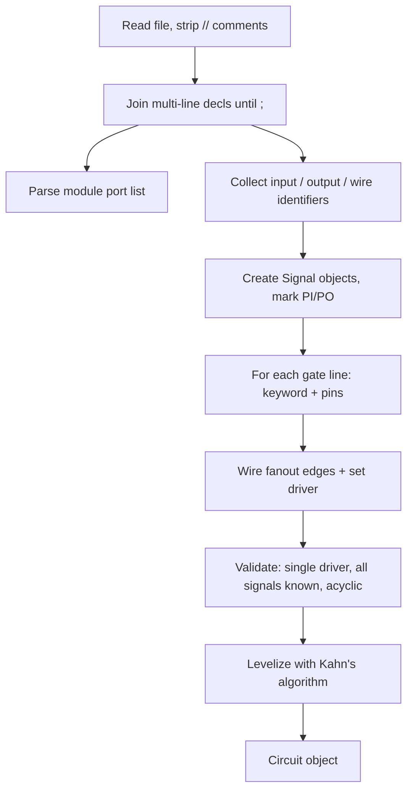

# ISCAS Verilog Parser — Design Reference

> Documentation derived from analysis of all 11 benchmark files in `ISCAS85_Circuits/`.
> Use this when implementing `src/parser/iscas_verilog.py` and the signal-centric `Circuit` model.

---

## Overview

The parser reads **ISCAS-style gate-level structural Verilog** (`.v`) and produces a **signal-centric `Circuit` object** used by fault collapsing, five-valued simulation, and PODEM. Downstream modules must not depend on Verilog syntax — only on `Circuit`, `Signal`, and `Gate`.

**v1 scope:** Primitive gate instances only (`and`, `or`, `nand`, `nor`, `not`, `buf`, `xor`, `xnor`). Reject `assign`, behavioral code, multi-driver nets, and sequential elements.

---

## Benchmark corpus

| File | PIs | POs | Wires | Gates | Logic depth | Max fanin | Max fanout |
|------|-----|-----|-------|-------|-------------|-----------|------------|
| c17.v | 5 | 2 | 4 | 6 | 3 | 2 | 2 |
| c432.v | 36 | 7 | 153 | 160 | 17 | **9** | 9 |
| c499.v | 41 | 32 | 170 | 202 | 11 | 5 | 12 |
| c880.v | 60 | 26 | 357 | 383 | 24 | 4 | 8 |
| c1355.v | 41 | 32 | 514 | 546 | 24 | 5 | 12 |
| c1908.v | 33 | 25 | 855 | 880 | 40 | 8 | **16** |
| c2670.v | 233 | 140 | 1,129 | 1,269 | 32 | 5 | 11 |
| c3540.v | 50 | 22 | 1,647 | 1,669 | 47 | 8 | **16** |
| c5315.v | 178 | 123 | 2,184 | 2,307 | 49 | 9 | 15 |
| c6288.v | 32 | 32 | 2,384 | 2,416 | **124** | 2 | **16** |
| c7552 (1).v | 207 | 108 | 3,405 | **3,513** | 43 | 5 | 15 |

**Suite totals:** 13,351 gates across 11 circuits.

### Global extremes

| Metric | Worst case | Value |
|--------|------------|-------|
| Gate count | `c7552 (1).v` | 3,513 |
| Primary inputs | `c2670.v` | 233 |
| Primary outputs | `c2670.v` | 140 |
| Internal wires | `c7552 (1).v` | 3,405 |
| Total signals | `c7552 (1).v` | ~3,720 |
| Logic depth (PI→PO) | `c6288.v` | 124 levels |
| Max fanin | `c432.v` | 9 (`AND9`) |
| Max fanout | `c1908.v`, `c3540.v`, `c6288.v` | 16 loads on one signal |

---

## File format

Every circuit follows the same structural pattern:

```verilog
// Verilog          ← optional metadata (missing in c1355.v)
// c880
// Ninputs 60
// Noutputs 26
// NtotalGates 383
// NAND2 60 ...     ← per-gate-type inventory (optional)

module c880 (...);     ← port list, often 10–40 lines
input ...;             ← multi-line, ends with ;
output ...;
wire ...;              ← hundreds to thousands of wires in large circuits
nand NAND2_1 (out, in1, in2);   ← one gate per line
...
endmodule
```

### What is **not** in this corpus

- No `assign` statements
- No `reg`, `always`, or behavioral code
- No `xnor` gate instances (support in parser for future-proofing only)
- No multi-driver nets
- No undriven nets (once declarations are parsed correctly)

---

## Gate representation

### Pin order (always the same)

```verilog
<keyword> <instance_name> (output, input1, input2, ...);
```

- **Output is always the first** argument.
- **Inputs follow**, comma-separated.
- **Fanin** = `len(pins) - 1`.

| Pattern | Example | Fanin |
|---------|---------|-------|
| Inverter | `not NOT1_1 (N190, N1);` | 1 |
| Buffer | `buf BUFF1_21 (N257, N69);` | 1 |
| 2-input | `nand NAND2_1 (N10, N1, N3);` | 2 |
| 5-input | `and AND5_0(N996,N925,N950,N912,N951,N986);` | 5 |
| 9-input | `and AND9_46 (N199, N154, ..., N180);` | 9 |

### Gate keyword → internal `GateType`

Use the **Verilog keyword**, not the instance name prefix:

| Keyword | Total count | Circuits present |
|---------|-------------|------------------|
| `nand` | 2,999 | 9 / 11 |
| `and` | 2,877 | 10 / 11 |
| `not` | 2,760 | 10 / 11 |
| `nor` | 2,370 | 8 / 11 |
| `buf` | 1,563 | 7 / 11 |
| `or` | 660 | 7 / 11 |
| `xor` | 122 | **c432, c499 only** |
| `xnor` | 0 | none in dataset |

Instance names (`NAND2_17`, `AND5_0`, `NOR8_3`, `NAND8_696`) encode fanin as a hint, but **pin count is authoritative**. Example: `nand NAND8_696 (N2279, N2067, ..., N903);` has 8 inputs regardless of naming.

Map keywords to enum (lowercase Verilog → uppercase enum):

```
and → AND, or → OR, nand → NAND, nor → NOR,
not → NOT, buf → BUF, xor → XOR, xnor → XNOR
```

### Fanin distribution (13,351 gates)

| Fanin | Gate count | Share |
|-------|------------|-------|
| 1 | 4,323 | ~32% |
| 2 | 7,657 | ~57% |
| 3 | 911 | ~7% |
| 4 | 290 | |
| 5 | 142 | |
| 8 | 23 | |
| 9 | 5 | |

Multi-input gates (fanin ≥ 3) are uncommon but must be supported. Observed shapes include `AND3`–`AND9`, `OR3`–`OR5`, `NAND3`–`NAND9`, `NOR3`–`NOR8`.

### Fanout distribution

Example for `c7552 (1).v` (largest circuit):

| Fanout | Signal count |
|--------|--------------|
| 1 | ~62% |
| 2 | ~25% |
| 3–5 | ~9% |
| ≥ 6 | ~4% |
| Max | 15 |

Max fanout 15–16 appears on only a handful of signals per large circuit. **v1 treats each wire as one fault site** — no branch-fault expansion needed.

---

## Syntax variations

The parser must tolerate these dialect differences across files:

### 1. Optional whitespace before `(`

**Spaced** (most files):

```verilog
nand NAND2_1 (N10, N1, N3);
and AND5_1750 (N6762, N5683, N5670, N5654, N5640, N5632);
```

**Compact** (all 546 gates in `c1355.v`):

```verilog
and AND2_0(N242,N225,N233);
and AND5_0(N996,N925,N950,N912,N951,N986);
```

Gate regex must allow optional space before `(` and flexible comma spacing.

### 2. Multi-line declarations

`module (...)`, `input`, `output`, and `wire` declarations span many lines until `;`. The tokenizer must **join continuation lines** before parsing identifiers.

### 3. Mixed tabs and spaces

Especially in `c1355.v` — normalize whitespace when joining lines.

### 4. Optional header comments

Most files include:

```
// Ninputs N
// Noutputs N
// NtotalGates N
// GATE_TYPE count ...
```

`c1355.v` has **no header block** — rely on parsed `input`/`output`/`wire` declarations. Header counts can be used for sanity checks when present.

---

## Signal naming

- Almost all signals: `N<number>` (e.g. `N1`, `N1171`, `N10025`).
- **154 signals with underscores** — only in `c7552 (1).v`:
  - `N241_I` — primary input
  - `N241_O` — primary output
  - Connected by: `buf BUFF1_3513 (N241_O, N241_I);`
- Identifiers are **case-sensitive**.
- **Identifier charset:** `[A-Za-z_][A-Za-z0-9_]*` (underscores required for c7552).

### Signal roles

| Role | Rule |
|------|------|
| Primary inputs | Declared in `input`; no gate driver; may be used directly in gate inputs without a `wire` declaration (see c17: `N6`, `N7`) |
| Primary outputs | Declared in `output`; driven by a gate output |
| Internal wires | Declared in `wire`; driven by exactly one gate |
| PO as gate output | All PO nets in this corpus are gate outputs (not port-only aliases) |
| PI driven by gate | **Never** occurs in this corpus — validate and reject if seen |
| Multi-driver nets | **None** in this corpus — validate single driver per non-PI signal |

### c17 correction vs plan example

The plan's abbreviated c17 example shows 3 inputs / 3 outputs. The actual `c17.v` has:

- **5 PIs:** `N1`, `N2`, `N3`, `N6`, `N7`
- **2 POs:** `N22`, `N23`
- **6 NAND gates**, all 2-input

`N6` and `N7` are inputs used directly in gates without separate `wire` declarations. PIs must be created as `Signal` objects even when not listed under `wire`.

---

## Output: signal-centric circuit model

### Objects

| Object | Key fields |
|--------|------------|
| **`Signal`** | `name`, `is_pi`, `is_po`, `driver` (Gate or None), `fanouts` (list of `FanoutEdge`), `value` (Logic5, for sim), `level` |
| **`FanoutEdge`** | `gate`, `input_index` |
| **`Gate`** | `id`, `instance_name`, `type` (GateType), `inputs` (ordered Signals), `output` (Signal), `level` |
| **`Circuit`** | `signals: dict[str, Signal]`, `gates: list[Gate]`, `primary_inputs`, `primary_outputs` (port order from Verilog), `levels: list[list[Gate]]` |

Fault sites map 1:1 to signal names: `{signal_name}_sa0`, `{signal_name}_sa1`.

Gate input **pins** are not separate nodes — faults live on the **signal** feeding the pin.

---

## Parse pipeline



### Step details

1. **Strip comments** — lines starting with `//` (header metadata preserved optionally for sanity checks).
2. **Join until `;`** — for `module`, `input`, `output`, `wire`.
3. **Parse module** — extract module name and ordered port list (defines test pattern bit order for PIs/POs).
4. **Parse declarations** — build `Signal` for every PI, PO, and `wire`.
5. **Parse gate instances** — one gate per line; map keyword → `GateType`; connect inputs/output; increment fanout on each input signal.
6. **Validate**
   - Every signal referenced in a gate is a known PI, PO, or wire.
   - Exactly one driver per non-PI signal.
   - No PI driven by a gate.
   - Graph is acyclic (levelization succeeds).
   - Reject unsupported constructs (`assign`, behavioral, etc.).
7. **Levelize** — Kahn's algorithm from PIs (PI level = 0); populate `Circuit.levels`.

---

## Parser implementation checklist

### Must handle

- [ ] Multi-line `module`, `input`, `output`, `wire` declarations
- [ ] Gate regex: optional space before `(`, flexible comma spacing
- [ ] Fanin from pin count, not instance name
- [ ] PIs as signals even when not declared as `wire`
- [ ] Fanout list construction during gate parsing
- [ ] Identifier charset including underscores (`N241_I`, `N241_O`)
- [ ] All 8 gate keywords (including `xnor` for future netlists)

### Validation checks

- [ ] Single driver per non-PI signal
- [ ] All gate-referenced signals declared
- [ ] Acyclic graph (levelization succeeds)
- [ ] Optional: compare parsed PI/PO/gate counts to header comments when present

### Not needed for v1 (based on this corpus)

- `assign` statement parsing
- Branch-fault / fanout expansion (max fanout = 16)
- Separate pin objects
- Yosys cell-name normalization (phase 2 — `parser/yosys_verilog.py`)

---

## Test matrix

Recommended parse tests in increasing complexity:

| Circuit | Why |
|---------|-----|
| **c17** | Smallest; spaced gate syntax; 5 PIs / 2 POs / 6 NAND |
| **c1355** | Compact gate syntax (no space before `(`); no header comments |
| **c432** | Max fanin (9); XOR gates |
| **c7552 (1).v** | Largest scale; underscore signal names (`N241_I`, `N241_O`) |

### Validation checkpoint (c17)

```
5 PIs, 2 POs, 6 NAND gates, levelized without cycle error
```

---

## Planned source layout

| Path | Purpose |
|------|---------|
| `src/circuit/circuit.py` | `Circuit`, `Gate`, `Signal`, `FanoutEdge`, `GateType` |
| `src/circuit/levelize.py` | Topological level assignment (Kahn) |
| `src/parser/base.py` | `NetlistParser` protocol / abstract base |
| `src/parser/iscas_verilog.py` | ISCAS `.v` parser (v1) |
| `src/parser/yosys_verilog.py` | Yosys parser stub (phase 2) |

---

## Implementation plan (step-by-step)

Forward build order for the parser module. Each step is independently testable before moving on — you never need the full parser working to validate the piece you just built.

### Build order summary

```
Step 0  Scaffold + pytest
Step 1  Data model                    ← test with manual objects
Step 2  Preprocessing utils            ← test with file snippets
Step 3  Declaration parser            ← test with real decl sections
Step 4  Gate line parser               ← test one line at a time
Step 5  Circuit builder                ← test tiny in-memory netlists
Step 6  Validation                     ← test valid + mutated circuits
Step 7  Levelization                   ← test c17 depth, cycle detection
Step 8  Full ISCAS parser              ← test c17 → full suite
Step 9  Pluggable interface           ← test protocol + stub
Step 10 Regression / performance      ← all 11 benchmarks
```

---

### Step 0 — Project scaffold

**Goal:** Minimal project skeleton so tests can run from day one.

**Deliverables:**

- `src/circuit/`, `src/parser/`, `tests/`
- `pyproject.toml` or `requirements.txt` with `pytest`
- Empty `__init__.py` files

**Testing:**

```bash
pytest --collect-only   # confirms test discovery works
```

---

### Step 1 — Core data model

**Goal:** Define the objects the parser will populate.

**Deliverables:** `src/circuit/circuit.py`

- `GateType` enum (`AND`, `OR`, `NAND`, `NOR`, `NOT`, `BUF`, `XOR`, `XNOR`)
- `FanoutEdge(gate, input_index)`
- `Signal(name, is_pi, is_po, driver, fanouts, level)`
- `Gate(id, instance_name, type, inputs, output, level)`
- `Circuit(name, signals, gates, primary_inputs, primary_outputs, levels)`

**Testing:** `tests/circuit/test_circuit.py`

| Test | Method |
|------|--------|
| Construct objects manually | Build a 2-gate mini-circuit in code; assert field values |
| PI/PO flags | `Signal("N1", is_pi=True)` vs wire signal |
| Fanout wiring | Add `FanoutEdge` to a signal; assert `len(signal.fanouts) == 1` |
| Ordered ports | `Circuit.primary_inputs` preserves insertion order (needed for test patterns later) |

No Verilog yet — pure Python dataclass tests.

---

### Step 2 — Verilog preprocessing utilities

**Goal:** Normalize raw `.v` text before parsing.

**Deliverables:** `src/parser/verilog_utils.py`

- Strip `//` comment lines
- Join multi-line statements until `;` (for `module`, `input`, `output`, `wire`)
- Split comma-separated identifier lists (handle newlines, tabs, extra spaces)

**Testing:** `tests/parser/test_verilog_utils.py`

| Test | Input | Assert |
|------|-------|--------|
| Comment removal | `// Ninputs 5\ninput N1;` | Yields `input N1;` only |
| Multi-line input | 3-line `input` ending in `;` | Single joined string |
| Tab handling | c1355-style tab-indented decl | Same identifiers as space version |
| Identifier split | `"N1,N2,\n N3"` | `["N1", "N2", "N3"]` |
| Underscore IDs | `"N241_I,N241_O"` | Preserved exactly |

Use **snippets** copied from real files (`c17.v`, `c1355.v`), not full circuits.

---

### Step 3 — Declaration parser

**Goal:** Extract module name, ports, PIs, POs, and wires.

**Deliverables:** `src/parser/decl_parser.py`

- `parse_module_header(stmt) → (name, ports)`
- `parse_input/output/wire(stmt) → list[str]`
- `parse_declarations(lines) → Declarations(module, ports, inputs, outputs, wires)`

**Testing:** `tests/parser/test_decl_parser.py`

| Test | Source | Assert |
|------|--------|--------|
| c17 declarations | Real `c17.v` | 5 inputs, 2 outputs, 4 wires |
| c432 multi-line | Real header section | PI=36, PO=7, wire count=153 |
| c1355 no header | Real `c1355.v` | Still parses; PI=41, PO=32 |
| Port order preserved | `c17.v` module port list | First PI is `N1`, PO order `[N22, N23]` |
| Unknown statement | `"assign x = y;"` | Ignored or flagged (document the choice) |

**Manual check:**

```python
decls = parse_declarations(c17_lines)
print(len(decls.inputs), len(decls.outputs), len(decls.wires))
# expect: 5, 2, 4
```

---

### Step 4 — Gate line parser

**Goal:** Parse a single gate instance line into structured data.

**Deliverables:** `src/parser/gate_parser.py`

- `parse_gate_line(line) → GateLine(type, instance, output, inputs)`
- Handle spaced and compact syntax (`nand G (a, b, c)` and `nand G(a,b,c)`)

**Testing:** `tests/parser/test_gate_parser.py`

| Test | Line | Assert |
|------|------|--------|
| 2-input NAND | `nand NAND2_1 (N10, N1, N3);` | type=NAND, fanin=2, out=N10 |
| NOT gate | `not NOT1_1 (N190, N1);` | fanin=1 |
| Compact AND5 | `and AND5_0(N996,N925,N950,N912,N951,N986);` | fanin=5 |
| 9-input AND | c432 `AND9_46` line | fanin=9 |
| XOR | c499 line | type=XOR |
| Invalid keyword | `foo BAR (a, b);` | raises `ParseError` |
| Missing semicolon | malformed line | raises `ParseError` |

Test **one line at a time** — no file I/O needed.

---

### Step 5 — Circuit builder (connectivity)

**Goal:** Turn declarations + gate lines into a wired `Circuit`.

**Deliverables:** `src/parser/circuit_builder.py`

- Create `Signal` for every PI, PO, wire
- PI signals: `driver=None`
- For each gate: create `Gate`, set output signal's `driver`, append `FanoutEdge` on each input
- PIs used in gates must already exist from `input` declarations (c17: `N6`, `N7`)

**Testing:** `tests/parser/test_circuit_builder.py`

Build from **hand-crafted** decls + gate lines first (tiny 3-gate netlist in test code), then:

| Test | Assert |
|------|--------|
| Fanout count | Signal feeding 2 gates has `len(fanouts) == 2` |
| Driver set | Internal wire's `driver` is the driving gate |
| PI driver | All PIs have `driver is None` |
| Gate inputs | `gate.inputs[0]` is correct `Signal` object (identity, not just name) |
| Gate types | Mixed AND/NAND/NOT counts match input lines |

**Mini-netlist test (in-memory):**

```verilog
input A, B;
output Y;
wire w;
nand g1(w, A, B);
not g2(Y, w);
```

→ 2 PIs, 1 wire, 1 PO, 2 gates, `w.fanouts[0].gate == g1`

---

### Step 6 — Validation layer

**Goal:** Catch illegal netlists before levelization.

**Deliverables:** `src/circuit/validate.py`

- `validate(circuit) → None` or raise typed errors

**Checks:**

1. Every gate input/output signal exists
2. Exactly one driver per non-PI signal
3. No PI driven by a gate
4. Every PO is driven (has a driver)
5. No undriven internal wires
6. (Optional) Header comment cross-check when present

**Testing:** `tests/circuit/test_validate.py`

| Test | How |
|------|-----|
| Valid c17 model | Parse/build c17 → `validate()` passes |
| Multi-driver | Manually attach 2 drivers to one wire → `MultiDriverError` |
| PI driven | Set `pi.driver = some_gate` → error |
| Undriven wire | Leave wire without driver → error |
| Unknown signal | Reference `"GHOST"` in gate → error |

Use **programmatic circuit mutation** for negative tests — don't need bad Verilog files.

---

### Step 7 — Levelization

**Goal:** Assign topological levels for forward implication.

**Deliverables:** `src/circuit/levelize.py`

- Kahn's algorithm from PIs (level 0)
- `circuit.levels: list[list[Gate]]` — gates grouped by level
- Set `signal.level` and `gate.level`

**Testing:** `tests/circuit/test_levelize.py`

| Test | Circuit | Assert |
|------|---------|--------|
| c17 depth | Real c17 | Max level = 3 |
| PI level | Any | All PIs have `level == 0` |
| Level monotonicity | Any | Every gate input level < gate level |
| Partition complete | c17 | Sum of gates in levels == total gates |
| Cycle detection | Inject back-edge in mini circuit | `CycleError` raised |
| c6288 stress | Full parse | Max depth ≈ 124, no crash |

**Structural sanity:**

```python
for level_gates in circuit.levels:
    for g in level_gates:
        assert all(s.level < g.level for s in g.inputs)
```

---

### Step 8 — Full ISCAS parser (integration)

**Goal:** End-to-end `parse_iscas_verilog(path) → Circuit`.

**Deliverables:** `src/parser/iscas_verilog.py`

- `IscasVerilogParser.parse(path) → Circuit`
- Orchestrates: read file → preprocess → declarations → gate lines → build → validate → levelize

**Testing:** `tests/parser/test_iscas_verilog.py`

#### Smoke tests (parametrize over benchmarks)

| Circuit | Key assertions |
|---------|----------------|
| **c17** | 5 PI, 2 PO, 6 gates, all NAND, levelized |
| **c1355** | 546 gates, compact syntax, no header |
| **c432** | 160 gates, XOR present, max fanin 9 |
| **c499** | XOR gates, 202 gates |
| **c7552** | 3513 gates, `N241_I`/`N241_O` parse correctly |

```python
@pytest.mark.parametrize("circuit,pi,po,gates", [
    ("c17.v", 5, 2, 6),
    ("c432.v", 36, 7, 160),
    # ...
])
def test_parse_counts(circuit, pi, po, gates):
    c = parse(f"ISCAS85_Circuits/{circuit}")
    assert len(c.primary_inputs) == pi
    assert len(c.primary_outputs) == po
    assert len(c.gates) == gates
```

#### Structural tests (all 11 circuits)

```bash
pytest tests/parser/test_iscas_verilog.py -k structural
```

Each must pass:

- `validate(circuit)` — no errors
- `len(circuit.levels) > 0`
- Header comment cross-check (when present): `// NtotalGates` matches

#### Gate-type inventory test (c880, c6288)

Compare parsed `GateType` counts against header comments:

```
// NAND2 60  →  count(type=NAND, fanin=2) == 60
```

---

### Step 9 — Pluggable parser interface

**Goal:** Abstract interface for future Yosys parser.

**Deliverables:** `src/parser/base.py`, stub `src/parser/yosys_verilog.py`

```python
class NetlistParser(Protocol):
    def parse(self, path: str) -> Circuit: ...
```

**Testing:** `tests/parser/test_parser_plugin.py`

| Test | Assert |
|------|--------|
| ISCAS implements protocol | `isinstance(IscasVerilogParser(), NetlistParser)` |
| Yosys stub | `YosysVerilogParser().parse(...)` raises `NotImplementedError` with clear message |
| Dispatch | Registry `get_parser("iscas")` returns working parser |

---

### Step 10 — Regression / performance gate

**Goal:** Confirm parser handles worst-case benchmarks within reasonable time.

**Testing:** `tests/parser/test_parser_regression.py`

| Test | Method |
|------|--------|
| Full suite | Parse all 11 files in one test; all pass validate + levelize |
| Performance | `c7552.v` parses in < 2 seconds (adjust threshold as needed) |
| Memory | No explosion on 3,513 gates (sanity, not strict profiling) |
| Idempotent | Parse same file twice → identical gate count and signal names |

```bash
pytest tests/parser/ -v
time python -c "from src.parser.iscas_verilog import parse; parse('ISCAS85_Circuits/c7552.v')"
```

---

### Definition of done (Module 1)

From `plan.md`, the parser module is **done** when:

- [ ] All deliverables in Steps 0–9 exist
- [ ] `pytest tests/parser/ tests/circuit/` passes
- [ ] **c17 checkpoint:** 5 PIs, 2 POs, 6 NAND gates, levelized
- [ ] All 11 ISCAS85 circuits parse without error
- [ ] `plan.md` status updated: `parser-circuit` → `done`

### Practical tips while building

1. **Never skip Step 5's mini-netlist tests** — they catch fanout/driver bugs faster than full benchmarks.
2. **Parametrize benchmark tests** — one test function, 11 circuits, easy to extend.
3. **Keep golden values in one place** — a `BENCHMARK_EXPECTATIONS` dict at the top of the test file, sourced from the benchmark table in this document.
4. **Commit after each step** — e.g. `add circuit data model and unit tests`, `add gate line parser with compact syntax support`.

---

## References

- Project plan: `plan.md` (Module 1 — Parser and circuit model)
- Benchmark files: `ISCAS85_Circuits/*.v`
- Analysis date: 2026-09-06
