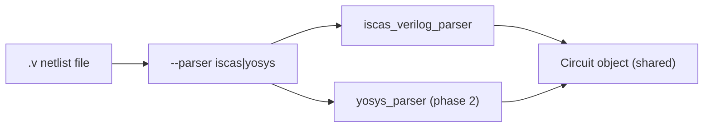
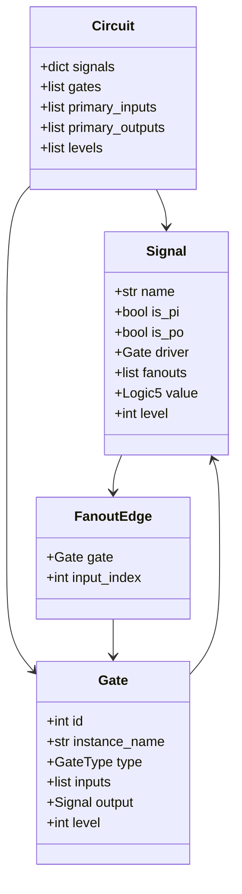
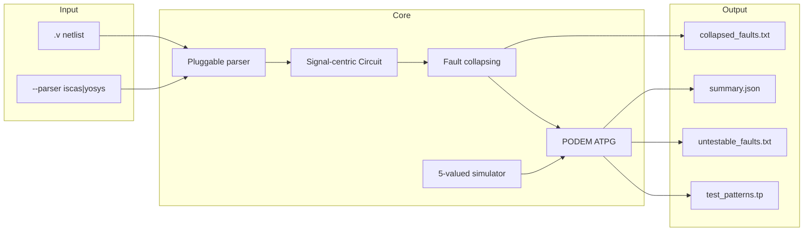
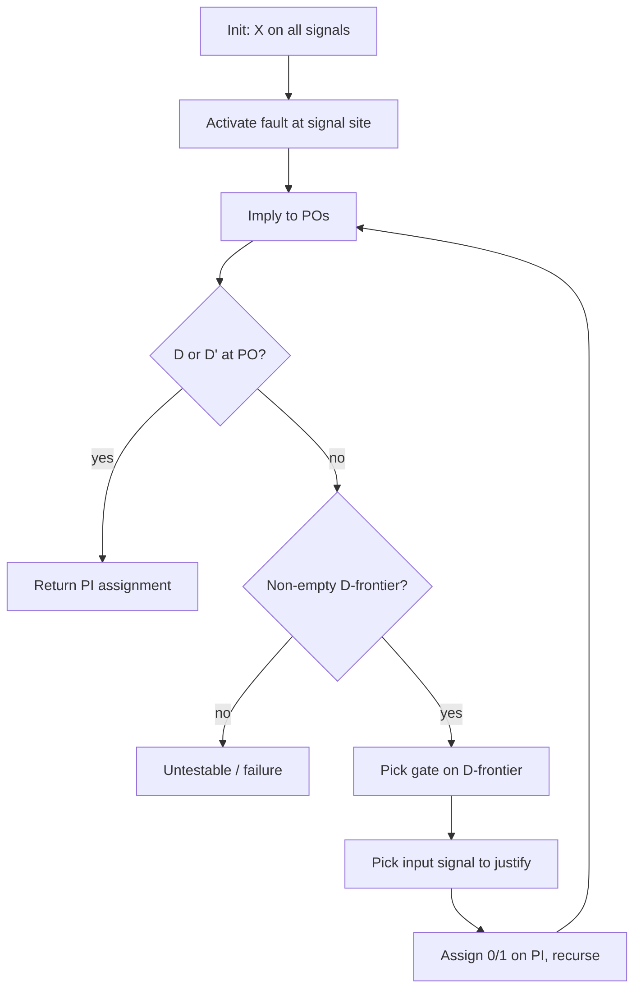

# ATPG Tool — PODEM + ISCAS'85

> Living implementation plan. Update this file as each module is built and validated.

## Build progress


| Module                                            | ID                    | Status        | Notes                                                                 |
| ------------------------------------------------- | --------------------- | ------------- | --------------------------------------------------------------------- |
| ISCAS Verilog parser, Circuit model, levelization | `parser-circuit`      | `done`        | Full ISCAS parser, validate, levelize, dump; c17 checkpoint passed |
| Pluggable parser interface; Yosys stub            | `parser-plugin`       | pending       |                                                                       |
| Five-valued forward implication and backtrace     | `sim-logic5`          | `in_progress` | `src/logic5.py` + tests done; `sim/implication.py` stub only          |
| Raw SA faults + equivalence/dominance collapsing  | `fault-collapse`      | pending       |                                                                       |
| PODEM loop, D-frontier, per-fault patterns        | `podem-core`          | pending       |                                                                       |
| CLI orchestration and output files                | `cli-outputs`         | pending       |                                                                       |
| End-to-end validation on ISCAS'85 suite           | `validate-benchmarks` | pending       |                                                                       |
| Fault simulator + pattern compaction (Phase 2)    | `compaction-optional` | pending       |                                                                       |


**Legend:** `pending` → `in_progress` → `done`

---


## Overview

Build a Python ATPG tool for all ISCAS'85 combinational benchmarks using single stuck-at faults:

1. Parse ISCAS-style Verilog (`.v`) netlists into a signal-centric circuit model
2. Collapse faults (equivalence + dominance)
3. Run PODEM per collapsed fault
4. Emit test patterns plus fault reports

Yosys-mapped netlist support is a later, pluggable parser extension.

---


## Input format: ISCAS-style Verilog (`.v`)

**v1 input:** Gate-level structural Verilog in the ISCAS'85 primitive style — one top module per file, `input`/`output` ports, `wire` declarations, and primitive gate instances (`and`, `or`, `nand`, `nor`, `not`, `buf`, `xor`, `xnor`).

**Future input:** Yosys-synthesized netlists mapped to the same ISCAS gate set. Added later as a **second pluggable parser**; the user selects the parser via CLI (`--parser iscas|yosys`).

Example ISCAS Verilog (c17, abbreviated):

```verilog
module c17(N1, N2, N3, N6, N22, N23);
  input N1, N2, N3;
  output N6, N22, N23;
  wire n10, n11, n16, n19, n22, n23;
  nand g10(n10, N1, n8);
  nand g11(n11, n9, N6);
  ...
endmodule
```


### Parser strategy (pluggable)




| Parser  | v1 scope           | Notes                                                                           |
| ------- | ------------------ | ------------------------------------------------------------------------------- |
| `iscas` | **Implement now**  | Primitive gate instances; ports = PI/PO; wires = internal signals               |
| `yosys` | **Stub / phase 2** | Normalizes `$_AND_`, `$_OR_`, etc. or mapped cell names to same `GateType` enum |


Both parsers must produce the **same internal** `Circuit` **object** so ATPG, collapsing, and PODEM are parser-agnostic.

### ISCAS'85 Verilog parsing steps

1. Parse `module` name, port list, `input`/`output` declarations
2. Collect `wire` declarations (create `Signal` objects)
3. Parse gate instances: `gate_type inst_name(out, in1, in2, ...)`
4. Map Verilog primitives → internal `GateType` enum (lowercase Verilog → uppercase enum)
5. Validate: every wire has exactly one driver (except PIs); no undriven nets; combinational only (acyclic)
6. Levelize gates from PIs (Kahn's algorithm)
7. Reject unsupported constructs in v1: `assign`, behavioral code, multi-driver nets, sequential elements


### Benchmark sources

Ship or download ISCAS'85 `.v` files (`c17`, `c432`, `c499`, `c880`, `c1355`, `c1908`, `c2670`, `c3540`, `c5315`, `c6288`, `c7552`). Use primitive-gate variants (e.g. `c880a.v` not cell-mapped `c880.v`).

Benchmarks live in `ISCAS85_Circuits/`. See also `parser.md` for Verilog dialect analysis and step-by-step parser plan.

---


## Signal-centric circuit model (DECIDED)


### Why signal-centric (not dual gate+wire graph nodes)


| Approach                        | Pros                                                                              | Cons                                                                               |
| ------------------------------- | --------------------------------------------------------------------------------- | ---------------------------------------------------------------------------------- |
| Gate + wire both as graph nodes | Visually matches schematic                                                        | PODEM implication/backtrace needs extra graph hops; fault sites ambiguous on edges |
| **Signal-centric (chosen)**     | Natural fit for five-valued sim; faults map 1:1 to wire names; fanout is explicit | Must keep gate objects for evaluation                                              |
| Gate-only adjacency list        | Compact                                                                           | Loses named fault sites; hard to align with Verilog wire names                     |


**Decision:** Use a **signal-primary model** where `Signal` is the central entity and `Gate` objects connect signals. This matches Verilog semantics, the `signal_name_sa0/sa1` fault naming convention, and PODEM's need to read/write values on circuit lines.

### Object model




#### `Signal`

- **name**: Verilog identifier (e.g. `N1`, `n10`) — also the **fault site name**
- **is_pi / is_po**: derived from port declarations
- **driver**: the `Gate` driving this signal, or `None` for primary inputs
- **fanouts**: list of `(gate, input_index)` tuples — every gate input this signal feeds (implemented as `list[tuple[Gate, int]]`, not a separate `FanoutEdge` class)
- **value**: current five-valued logic during PODEM search (`0`, `1`, `X`, `D`, `D'`)
- **level**: topological level (PIs = 0; others = driver gate level or max fanin level + 1)


#### `Gate`

- **id**: internal integer index (for D-frontier ordering, not used in fault names)
- **instance_name**: Verilog instance label (e.g. `g10`) — for debug/logging only
- **type**: `AND | OR | NAND | NOR | NOT | BUF | XOR | XNOR`
- **inputs**: ordered list of `Signal` references
- **output**: single `Signal` reference
- **level**: assigned after levelization; gates processed in ascending level during forward implication


#### `Circuit`

- Container with `signals: dict[str, Signal]`, `gates: list[Gate]`
- Ordered `primary_inputs` and `primary_outputs` (port order from Verilog module — defines test pattern bit order)
- `levels: list[list[Gate]]` for levelized forward implication


### How operations map to this model


| Operation           | Walk                                                                                         |
| ------------------- | -------------------------------------------------------------------------------------------- |
| Forward implication | For each level, evaluate each gate from its input signal values → write output signal value  |
| Backtrace (PODEM)   | Start at a gate output signal; pick controlling values on input signals based on `Gate.type` |
| Fault injection     | Set `signal.value` on the fault site; PODEM propagates D/D' from there                       |
| Fault enumeration   | One SA0 + one SA1 per eligible `Signal` name                                                 |


### Fanout and fault sites

ISCAS Verilog converted from legacy format often **already names fanout branches as separate wires** (e.g. `n8`, `n9` both driven from a stem). In that case, each wire is its own fault site — no extra expansion needed.

When a **single wire fans out to multiple gates** (fanout > 1):

- **v1 decision:** Treat the wire as **one fault site** (`wire_name_sa0`, `wire_name_sa1`). This is the standard line/stuck-at model used in most ATPG tools on gate-level Verilog.
- **Optional later:** Expand into branch signals (`wire_name__g10_in0`, `wire_name__g11_in1`) if branch-fault accuracy is required.


### What we explicitly do NOT model as separate nodes

- Gate input **pins** — faults are on the **signal** feeding the pin, not a separate pin object
- Gate output **pins** — the output **signal** is the fault site
- This keeps fault names aligned with Verilog: `n10_sa0` means wire `n10` stuck-at-0

---


## Fault naming convention (DECIDED)


| Form                | Example   | Meaning                       |
| ------------------- | --------- | ----------------------------- |
| `{signal_name}_sa0` | `n10_sa0` | Wire `n10` stuck-at-0         |
| `{signal_name}_sa1` | `N1_sa1`  | Primary input `N1` stuck-at-1 |


Rules:

- Use the **exact Verilog wire/port identifier** (case-sensitive)
- No gate-id or pin-index in the name
- Collapsed-fault report lists representative name + members collapsed into it
- Untestable list uses the same names

Internal `Fault` type: `Fault(signal_name: str, stuck_at: Literal[0, 1])` with string serialization `f"{signal_name}_sa{stuck_at}"`.

---


## High-level architecture




### Package layout


| Path                          | Purpose                                             | Status      |
| ----------------------------- | --------------------------------------------------- | ----------- |
| `src/parser/base.py`          | `NetlistParser` protocol / abstract base            | pending     |
| `src/parser/iscas_verilog.py` | ISCAS `.v` parser (v1)                              | **done**    |
| `src/parser/yosys_verilog.py` | Yosys parser stub (phase 2)                         | pending     |
| `src/circuit/circuit.py`      | `Circuit`, `Gate`, `Signal`, `GateType`             | **done**    |
| `src/circuit/validate.py`     | Post-parse validation (drivers, unused wires)       | **done**    |
| `src/circuit/levelize.py`     | Topological level assignment                        | **done**    |
| `src/circuit/dump.py`         | Human-readable circuit dump for verification        | **done**    |
| `src/fault/fault.py`          | `Fault` with `signal_name_sa0/sa1` naming           | pending     |
| `src/fault/collapsing.py`     | Equivalence + dominance collapsing                  | pending     |
| `src/logic5.py`               | Five-valued algebra (0, 1, X, D, D') + `eval_gate`  | **done**    |
| `src/sim/implication.py`      | Forward implication + backtrace                       | stub only   |
| `src/atpg/podem.py`           | PODEM main loop                                     | pending     |
| `src/atpg/fault_sim.py`       | Parallel fault simulation (compaction + validation) | pending     |
| `src/cli/main.py`             | Orchestration + file I/O                            | pending     |
| `pyproject.toml`              | Project config + pytest                             | **done**    |
| `tests/circuit/`              | Unit tests for circuit model                        | **done**    |
| `tests/test_logic5.py`        | Unit tests for five-valued eval                     | **done**    |


---


## Module 1 — Parser and circuit model

**Status:** `done`

### Deliverables

- [x] `GateType` enum with `from_v()` Verilog keyword mapping
- [x] `Signal`, `Gate`, `Circuit` data classes (`Signal.fanouts` as `list[tuple[Gate, int]]`)
- [x] `Signal.value: Logic5` (default `X`)
- [x] Unit tests: `tests/circuit/test_gate_type.py`, `test_signal.py`, `test_circuit.py`
- [x] `iscas_verilog.py` — parse module, ports, wires, gate instances (`parse_iscas_verilog`)
- [x] `validate.py` — undriven PO/wire checks, unused wire check, connectivity sanity
- [x] `levelize.py` — Kahn's algorithm, `Circuit.levels`, cycle detection
- [x] `dump.py` + `circuit_print.py` — formatted `.txt` dumps to `Circuit_prints/`
- [x] Unit test: `c17.v` full connectivity + levels (depth 3); gate tests on c432/c1355


### Validation checkpoint

```
c17: 5 PIs, 2 POs, 6 NAND gates, levelized
```

---


## Module 2 — Fault list and collapsing

**Status:** pending

### Raw fault list (single stuck-at)

For every signal in the circuit (PIs, internal wires, PO nets):

- `{signal_name}_sa0`
- `{signal_name}_sa1`

PO signals are included (fault on output net before the port).

### Fault equivalence (collapse first)

Rules operate on the **gate driving or fed by a signal**, using signal names in equivalence classes:


| Gate     | Equivalence examples                                          |
| -------- | ------------------------------------------------------------- |
| AND      | All input signals SA0 ≡ output signal SA0                     |
| OR       | All input signals SA1 ≡ output signal SA1                     |
| NAND     | All input signals SA0 ≡ output signal SA1                     |
| NOR      | All input signals SA1 ≡ output signal SA0                     |
| NOT/BUF  | Input signal SAx ≡ output signal SAx (inverted value for NOT) |
| XOR/XNOR | **No input↔output equivalence**                               |


Build equivalence classes; keep one representative per class (prefer output signal fault when tied).

### Fault dominance (collapse second)

- On AND: `{input}_sa1` dominated by `{output}_sa1`
- On OR: `{input}_sa0` dominated by `{output}_sa0`
- Mirrored rules for NAND/NOR

Report file maps `representative → [collapsed members]` using `signal_name_sa0/sa1` strings.

### Deliverables

- [ ] `Fault` type with `__str__` → `signal_sa0/sa1`
- [ ] `generate_raw_faults(circuit)` → list of `Fault`
- [ ] `collapse_faults(circuit, faults)` → representatives + collapse map
- [ ] Sanity-check collapsed count on `c17`

---


## Module 3 — Five-valued simulation

**Status:** `in_progress`

### Logic5 values


| Value | Meaning                            |
| ----- | ---------------------------------- |
| `0`   | Logic zero (good and faulty agree) |
| `1`   | Logic one (good and faulty agree)  |
| `X`   | Unknown                            |
| `D`   | Good=1, faulty=0                   |
| `D'`  | Good=0, faulty=1                   |


### Deliverables

- [x] `src/logic5.py` — `Logic5` enum + per-gate eval + `eval_gate()` (multi-input NAND/NOR/XNOR: fold primitive, invert once)
- [x] Unit tests: `tests/test_logic5.py` (including D/D' cases and multi-input inverting gates)
- [ ] `sim/implication.py` — levelized forward implication
- [ ] `sim/implication.py` — backtrace from gate output to controlling input values
- [ ] Per-gate backtrace / controlling tables (especially XOR on `c499`)

---


## Module 4 — PODEM test pattern generation

**Status:** pending

### Prerequisites

1. Five-valued logic on every `Signal.value`
2. Forward implication: walk `Circuit.levels`, evaluate gates
3. Backtrace: from gate output signal to input signals
4. Fault injection: for `n10_sa0`, force `signals["n10"].value = 0` in faulty machine


### PODEM loop (per fault)




### Untestable vs aborted


| Outcome                         | Meaning                    |
| ------------------------------- | -------------------------- |
| PODEM complete search → failure | **Untestable** (redundant) |
| Backtrack/timeout limit hit     | **Aborted** (inconclusive) |


### Deliverables

- [ ] D-frontier detection
- [ ] PODEM recursive search with backtracking
- [ ] Per-fault pattern output (PI bit vector in port order)
- [ ] Single-fault test on `c17`
- [ ] Batch run over collapsed fault list

---


## Module 5 — CLI and outputs

**Status:** pending

### CLI

```bash
python -m atpg \
  --circuit benchmarks/c17.v \
  --parser iscas \
  --out-dir results/c17 \
  --collapse \
  --algorithm podem
```

Future:

```bash
python -m atpg --circuit synth/c432_mapped.v --parser yosys ...
```


### Output files


| File                    | Contents                                                                 |
| ----------------------- | ------------------------------------------------------------------------ |
| `test_patterns.tp`      | One line per pattern: `0/1` values in PI port order                      |
| `collapsed_faults.txt`  | Representative `signal_sa0/sa1` + collapsed members                      |
| `untestable_faults.txt` | `signal_sa0/sa1` + reason (`redundant` / `aborted`)                      |
| `summary.json`          | Circuit, parser used, raw/collapsed fault counts, pattern count, runtime |


### Deliverables

- [ ] `cli/main.py` with `--parser`, `--circuit`, `--out-dir`, `--collapse` flags
- [ ] Write all four output files
- [ ] End-to-end run on `c17`

---


## Module 6 — Full benchmark validation

**Status:** pending

### ISCAS'85 combinational suite


| Circuit | Gates (approx) | Notes                               |
| ------- | -------------- | ----------------------------------- |
| c17     | 6              | Smoke test                          |
| c432    | 160            |                                     |
| c499    | 202            | XOR-heavy — test early              |
| c880    | 383            | Use `c880a.v`                       |
| c1355   | 546            |                                     |
| c1908   | 880            |                                     |
| c2670   | 1269           |                                     |
| c3540   | 1669           |                                     |
| c5315   | 2318           |                                     |
| c6288   | 2416           | 16×16 multiplier; per-fault timeout |
| c7552   | 3712           |                                     |


### Deliverables

- [ ] All benchmarks parse and levelize
- [ ] Collapsed fault counts are reasonable vs references
- [ ] PODEM completes (or times out gracefully) on each circuit
- [ ] XOR controlling tables validated on `c499`
- [ ] `c6288` per-fault timeout + progress logging

---


## Module 7 — Pattern compaction (Phase 2)

**Status:** pending (deferred)

Requires fault simulator + greedy set cover on patterns from Module 4.

### Deliverables

- [ ] `fault_sim.py` — parallel fault simulation
- [ ] Greedy set-cover compaction
- [ ] Compacted pattern count in `summary.json`

---


## Pluggable parser interface (Module 1b)

**Status:** pending

### Deliverables

- [ ] `NetlistParser` protocol in `parser/base.py`
- [ ] `IscasVerilogParser` implements protocol
- [ ] `YosysVerilogParser` stub raises `NotImplementedError` with clear message
- [ ] CLI `--parser iscas|yosys` dispatches to correct parser

---


## Suggested implementation order

1. ~~**Signal-centric** `Circuit` **model** — data classes~~ **done**
2. ~~**ISCAS Verilog parser** — declarations, gates, validate, levelize~~ **done** (`c17` checkpoint passed)
3. **Binary good-circuit simulator** — verify gate evaluation (optional; covered partly by `logic5` tests)
4. ~~**Five-valued algebra** — `src/logic5.py` + `eval_gate`~~ **done**; **implication + backtrace next**
5. **Raw fault list (**`signal_sa0/sa1`**) + collapsing** — sanity-check counts on `c17`
6. **PODEM** — single fault on `c17`, then batch
7. **CLI + output files** — full pipeline
8. **Full ISCAS'85 suite** — XOR tuning, `c6288` limits
9. **(Phase 2)** Yosys parser plugin + pattern compaction

---


## Risks and mitigations


| Risk                                               | Mitigation                                                                             |
| -------------------------------------------------- | -------------------------------------------------------------------------------------- |
| Verilog dialect differences across benchmark repos | Pin one upstream source; document expected gate syntax                                 |
| XOR/XNOR PODEM bugs                                | Gate-specific controlling tables; test `c499` early                                    |
| Signal name collisions after Yosys                 | Yosys parser normalizes names; keep internal IDs separate from display names if needed |
| Over-aggressive collapsing                         | Validate with fault sim; compare collapsed counts to references                        |
| `c6288` runtime                                    | Per-fault timeout; progress logging                                                    |


---


## Out of scope for v1

- Sequential circuits (ISCAS'89)
- `.bench` / legacy `.isc` parsers (Verilog is canonical input; converters exist upstream)
- Yosys parser implementation (interface only)
- Multiple fault models
- Optimal compaction

---


## Repository


| Host   | URL                                                                                                                                              |
| ------ | ------------------------------------------------------------------------------------------------------------------------------------------------ |
| GitHub | [https://github.com/saravana-vikas/combinational-podem-atpg-v1](https://github.com/saravana-vikas/combinational-podem-atpg-v1)                   |
| Cursor | [https://cursor.com/codebase/saravana-vikas/combinational-podem-atpg-v1](https://cursor.com/codebase/saravana-vikas/combinational-podem-atpg-v1) |


---


## Changelog


| Date       | Module         | Change                                                                                                      |
| ---------- | -------------- | ----------------------------------------------------------------------------------------------------------- |
| 2026-09-08 | `parser-circuit` | Circuit model: `GateType`, `Signal`, `Gate`, `Circuit`; pytest scaffold; `parser.md`                        |
| 2026-09-08 | `sim-logic5`   | `src/logic5.py`: `Logic5`, gate eval, `eval_gate` (fixed multi-input inverting gates); `Signal.value` wired |
| 2026-09-06 | —              | Initial plan created                                                                                        |


